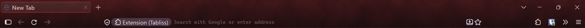

# Oxford Maroon

A reading-room theme for Firefox, written as a `userChrome.css` stylesheet. Oxblood leather, warm bone text, a maroon ribbon under the open tab, and a lamp glow in the corner. It is quiet: the only motion is a thin sheen across a tab while a page loads.

## Install

1. **Fonts (optional, free).** Install [Alegreya Sans](https://fonts.google.com/specimen/Alegreya+Sans) for the interface and [JetBrains Mono](https://fonts.google.com/specimen/JetBrains+Mono) for the address bar. Without them Firefox falls back to Segoe UI and Consolas.
2. **Allow custom stylesheets.** In `about:config`, set `toolkit.legacyUserProfileCustomizations.stylesheets` to `true`.
3. **Find your profile folder.** Open `about:support` and choose *Open Folder* next to *Profile Folder*. Create a `chrome` folder inside it.
4. **Copy the files.** Put `userChrome.css` in `chrome/`, and `themes/oxford.css` in `chrome/themes/`.
5. **Restart.** Quit Firefox completely and reopen it. userChrome changes only load at startup.

## Adjust

- `--brass` is the accent (`#b23a3a`). The name is left over from an earlier brass version.
- `--ox` is the ribbon under the selected tab (`#8a2226`).
- To go back to stock Firefox, remove or comment out the `@import` line in `userChrome.css` and restart.

Made and used on Firefox for Windows. Menus and panels are styled; some built-in pages keep Firefox's own colors.

## License

MIT. See [LICENSE](LICENSE).
